  

## 📌 About Me
- Aspiring Software Developer | Tech Enthusiast | Curious learner | Electronics and Computer Science Student at Ramdeobaba College of Engineering and Management.
- Passionate about transforming ideas into code and solving real-world problems through programming. Currently pursuing my B.tech degree at Ramdeobaba College of Engineering and Management, where I'm building a strong foundation in electronics, computer science, and software development.

## 🧠 My Focus Areas
- open source contribution
- Web development
- Software development

## 📊 GitHub Stats & Trophies

  
  

  

## 🛠️ Languages & Tools

<h3 align="center">Programming Languages</h3>

  &nbsp;&nbsp;&nbsp;&nbsp;&nbsp;
  &nbsp;&nbsp;&nbsp;&nbsp;&nbsp;
  

<h3 align="center">Tools</h3>

  &nbsp;&nbsp;&nbsp;&nbsp;&nbsp;
  

  

## 🔗 Connect with Me

  &nbsp;&nbsp;&nbsp;&nbsp;&nbsp;
  &nbsp;&nbsp;&nbsp;&nbsp;&nbsp;
  

  

  

